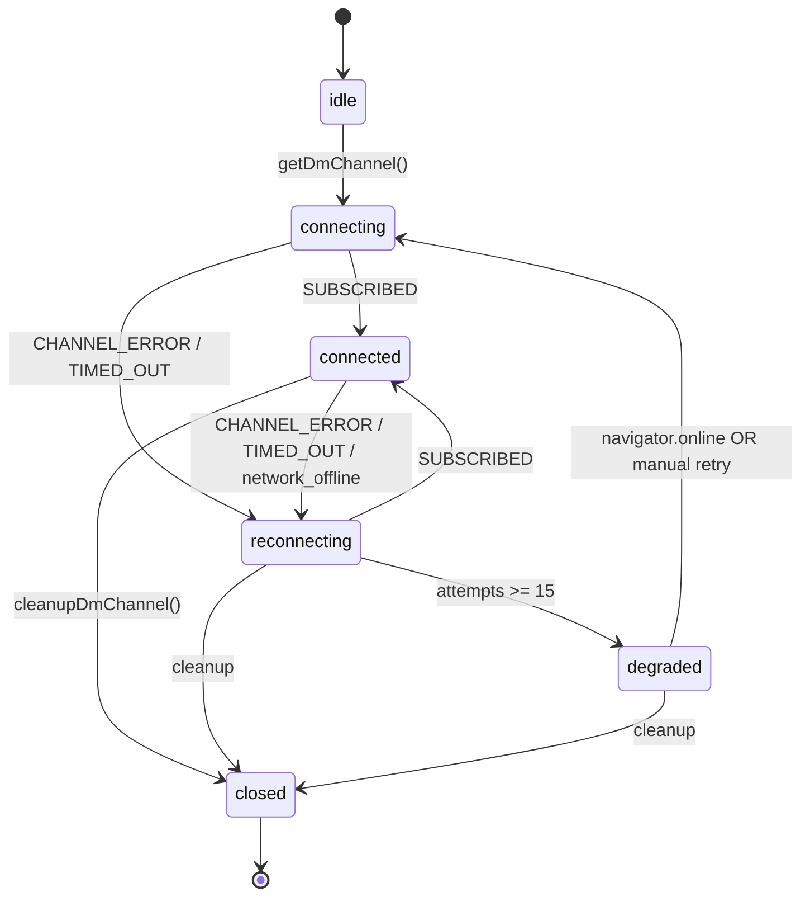
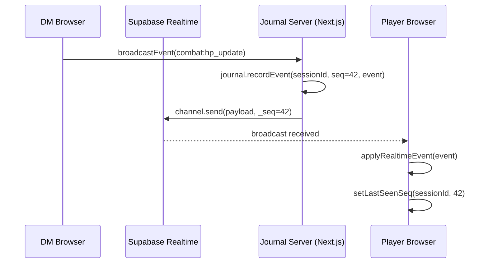
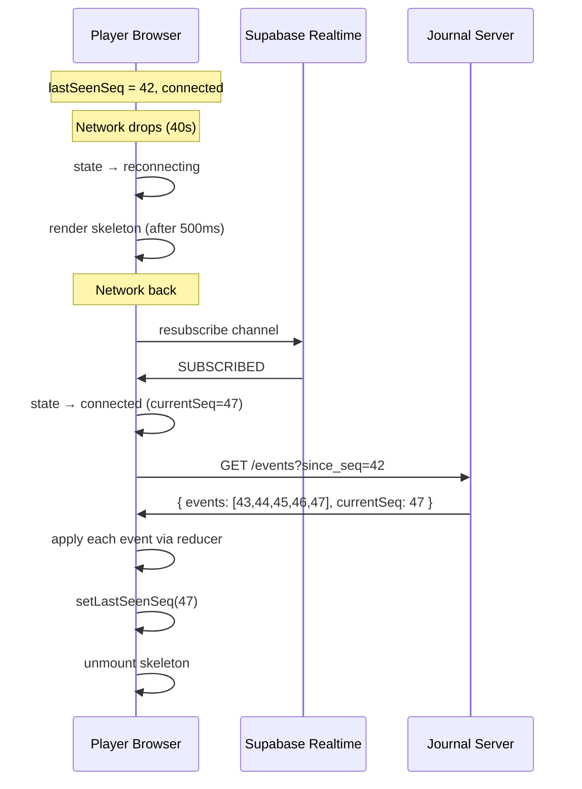
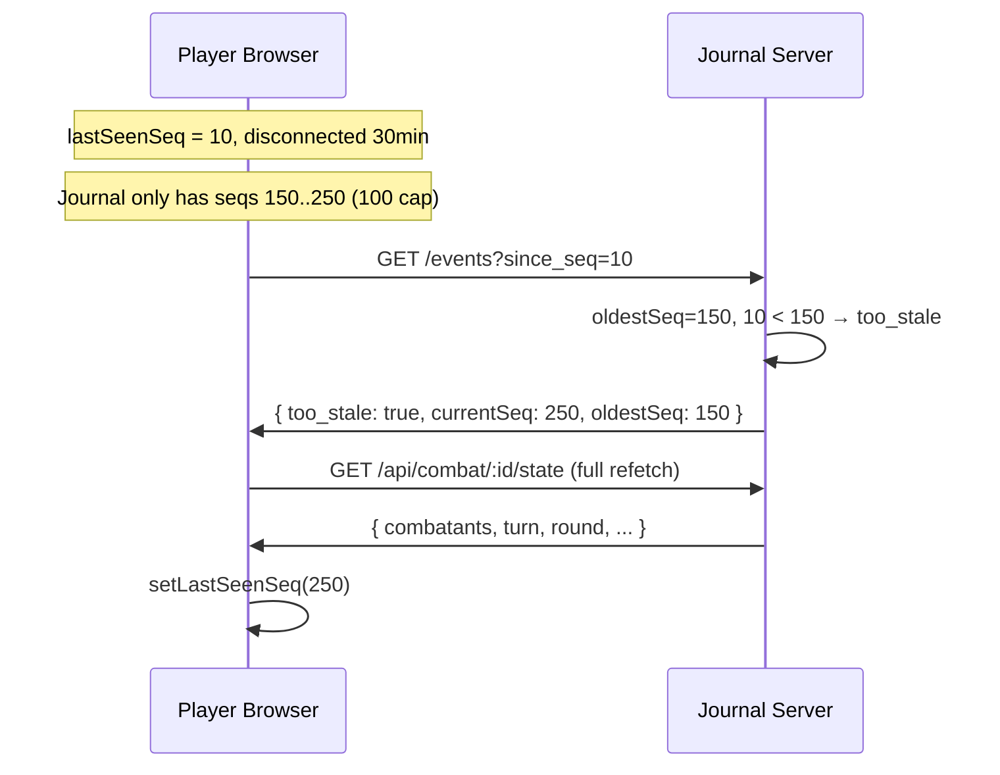
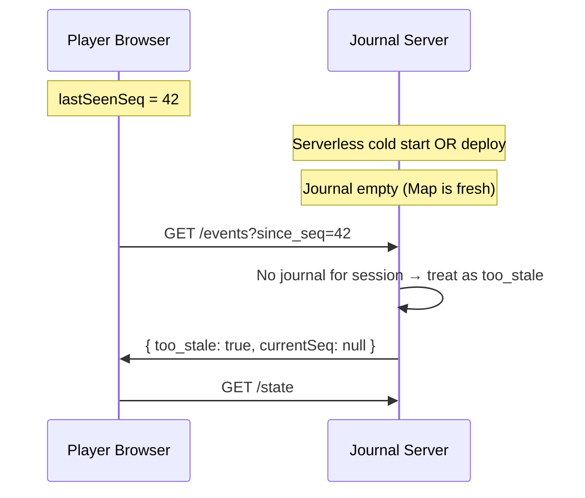
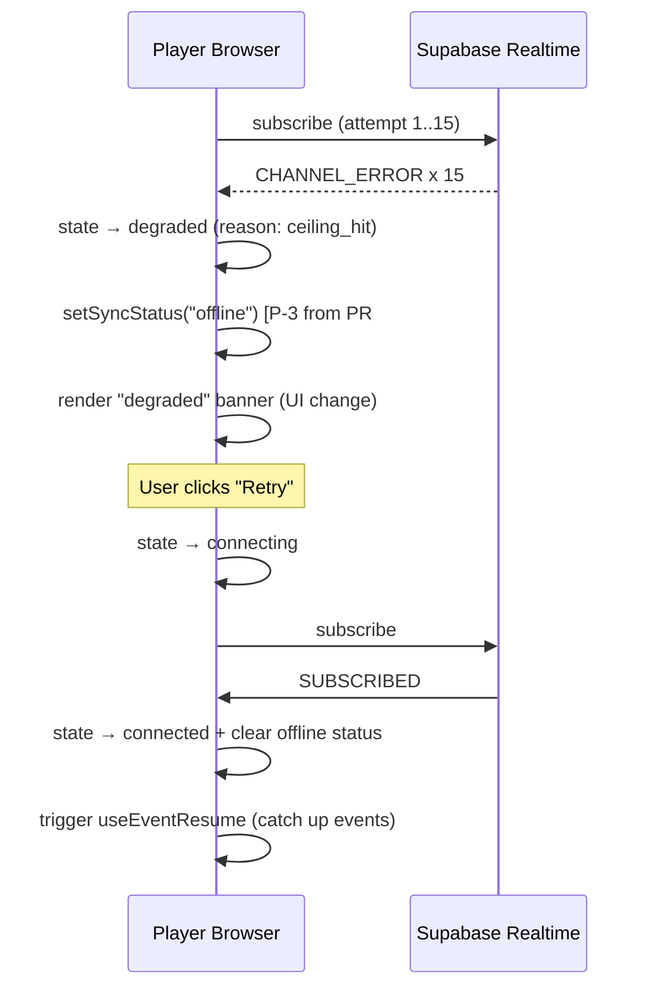

# Tech Spec — Estabilidade Combate

**Autor:** Winston (Architect)
**Data:** 2026-04-24
**Status:** Ready for implementation
**Scope:** Sprint CR-1 (5 dias úteis). Beta #5 como gate.

---

## 1. Contexto

### O que quebrou (evidência)

**Beta #4 (Lucas Galuppo, 2026-04-23), combate 3h:**
- 19 combatants, round 4, Dao + Earth Elementals + Myrmidons + Giant Owls
- Player anônimo sai 40s mid-combat, volta com estado stale
- **HP de monstro hidden apareceu correto no refresh** (F02 — fixado em PR #48 via SSR sanitize)
- CDC pool Supabase saturou às 00:06–00:42 UTC (postmortem 2026-04-24)

**Review adversarial PR #48 (2026-04-24):**
- IG-1: validação client/server drift (cap 99 server, no cap client)
- P-2: retry counter sem decay (burn budget em flaps iniciais)
- P-3: ceiling-hit silent (DM broadcast into void)
- **Evidence gap:** reconnect = refetch full state. Zero state reconciliation.

### O que já temos (PR #48)

- **L1 Transport:** exp backoff + jitter clamped + ceiling 15 + counter decay on successful send
- **Signal:** `setSyncStatus("offline")` on ceiling hit
- **Supabase config:** `worker: true` (com feature detection), `heartbeatIntervalMs: 20000`
- **Broadcast sanitize:** `display_name` trim + SSR apply

### O que falta (este spec)

1. **State machine explícita** (L1 polish) — hoje implícita, consumers não observam
2. **Event journal + resume endpoint** (L3) — fecha "player perdido voltou stale"
3. **Client resume hook + skeleton UI** (L3) — integra com state machine
4. **Shared Zod schema** (L5 phase 1) — fecha drift client/server
5. **Timing constants** (L2 polish) — reconciliar 3 heartbeats hoje desalinhados

---

## 2. Princípios de Design

### Não inventar

Todo item abaixo tem canônico industrial. Referências:

| Decisão | Canônico | Nossa aplicação |
|---|---|---|
| Exp backoff + jitter + ceiling | Socket.io (2011) | `broadcast.ts:createAndSubscribe` (já feito PR #48) |
| Discriminated union pra state machine | Finite State Machine pattern, XState | `lib/realtime/connection-state.ts` |
| Ring buffer + seq cursor | IRC (1988), Matrix `/sync`, Slack `mpim.history`, Discord Gateway `Resume` | `lib/realtime/event-journal.ts` + `/api/combat/[id]/events?since_seq=X` |
| Too-stale fallback | Matrix (timeline.limited), Discord (Invalid Session) | Response `{too_stale: true}` → client refetch `/state` |
| Single schema client+server | Zod + tRPC ecosystem | `lib/schemas/*.ts` |

### Pragmatismo sobre perfeição

- **In-memory journal** antes de Redis. Serverless restart → fallback full refetch. Aceito pro MVP.
- **Buffer cap 100** antes de benchmark. Ajusta se métrica mostrar.
- **Sprint 1 = fechar a dor do Piper**. L4 optimistic UI e L2 deep heartbeat ficam pro próximo sprint.

### Observabilidade como artefato

Toda story deve ter métrica pra medir se o fix funcionou. Não acabamos CR-04 sem dashboard de reconnect success rate.

---

## 3. Arquitetura

### 3.1 Camadas e responsabilidades

```
┌────────────────────────────────────────────────────────┐
│  UI Layer (PlayerJoinClient, CombatSessionClient)       │
│  ↓ subscribes to connection state                       │
│  ↓ renders skeleton during "reconnecting"               │
│  ↓ renders "degraded" banner on ceiling hit             │
├────────────────────────────────────────────────────────┤
│  useEventResume hook (CR-03)                            │
│  ↓ on state transition (reconnecting → connected)       │
│  ↓ fetches /events?since_seq=X                          │
│  ↓ applies via same reducer as live broadcasts          │
│  ↓ falls back to /state if too_stale                    │
├────────────────────────────────────────────────────────┤
│  ConnectionState Machine (CR-01)                        │
│  ↓ emits state transitions via pubsub                   │
│  ↓ owns retry timer, ceiling, backoff state             │
├────────────────────────────────────────────────────────┤
│  broadcast.ts (Supabase Realtime wrapper)               │
│  ↓ subscribe, send, teardown                            │
│  ↓ writes every outbound event to event journal         │
├────────────────────────────────────────────────────────┤
│  Event Journal (CR-02) — server-side ring buffer        │
│  ↓ Map<sessionId, Event[]> capped at 100 per session    │
│  ↓ cleanup task every 5min: purge sessions idle >1h     │
└────────────────────────────────────────────────────────┘

┌────────────────────────────────────────────────────────┐
│  Zod Schemas (CR-05) — shared client + server           │
│  ↓ lib/schemas/player-registration.ts (phase 1)         │
│  ↓ validates at client form + server action             │
└────────────────────────────────────────────────────────┘
```

### 3.2 Connection State Machine (CR-01)

Tipo canônico:

```typescript
export type ConnectionState =
  | { kind: "idle" }
  | { kind: "connecting"; attempt: number; since: number }
  | { kind: "connected"; subscribedAt: number; currentSeq: number }
  | { kind: "reconnecting"; attempt: number; since: number; backoffMs: number }
  | { kind: "degraded"; reason: DegradedReason; since: number }
  | { kind: "closed" };

export type DegradedReason =
  | "ceiling_hit"      // 15 retries exausto
  | "network_offline"  // navigator.onLine === false
  | "broker_down";     // ceiling + navigator.onLine === true (broker falhou)
```

**Transições válidas:**



**API pública:**

```typescript
// lib/realtime/connection-state.ts
export function getConnectionState(): ConnectionState;
export function onConnectionStateChange(cb: (s: ConnectionState) => void): () => void;

// Internal (used by broadcast.ts)
export function transitionTo(next: ConnectionState): void;
```

**Invariantes:**
- Nenhuma transição "pula" estados (ex: `idle → connected` inválido, tem que passar por `connecting`)
- `degraded` é estado terminal até `connecting` explícito (`navigator.online` event ou UI retry)
- Emissão é síncrona; listeners chamados em order de registro

### 3.3 Event Journal (CR-02) — Postgres-backed

> **Revisado 2026-04-26 (Caminho A).** Implementação original (in-memory `Map` module-level) era dead code: `recordEvent` rodava no DM browser, `getEventsSince` no serverless function — runtimes separados, Map server-side sempre vazio. Migrado pra Postgres `combat_events` (migration 184).

**Data model:**

```sql
CREATE TABLE combat_events (
  seq          BIGSERIAL    PRIMARY KEY,        -- global monotonic
  session_id   UUID         NOT NULL,           -- scoping
  event_type   TEXT         NOT NULL,           -- denormalized pra logs
  event        JSONB        NOT NULL,           -- payload sanitizado
  created_at   TIMESTAMPTZ  NOT NULL DEFAULT NOW()
);

CREATE INDEX idx_combat_events_session_seq
  ON combat_events (session_id, seq DESC);
CREATE INDEX idx_combat_events_session_created
  ON combat_events (session_id, created_at DESC);

ALTER TABLE combat_events ENABLE ROW LEVEL SECURITY;
-- Sem policies = deny-all. Service-role bypassa.
```

**TypeScript shape:**

```typescript
interface JournalEntry {
  seq: number;           // global bigserial; comparações `> since_seq` preservam ordem per-session
  sessionId: string;
  timestamp: string;     // ISO 8601 de combat_events.created_at
  event: SanitizedEvent;
}

const BUFFER_CAP = 100;
```

**Operations:**

```typescript
// Server-side from /api/broadcast, AFTER sanitize gate
export async function recordEvent(
  sessionId: string,
  event: SanitizedEvent,
): Promise<number | null>;  // returns assigned seq, or null on DB error (non-fatal)

// Server-side from /api/combat/[id]/events
export async function getEventsSince(
  sessionId: string,
  sinceSeq: number,
): Promise<EventsSinceResult>;

type EventsSinceResult =
  | { kind: "events"; events: JournalEntry[]; currentSeq: number }
  | {
      kind: "too_stale";
      currentSeq: number;
      oldestSeq: number;
      instruction: "refetch_full_state";
    }
  | { kind: "empty"; currentSeq: number };
```

**Ring buffer semantics (preservadas via trigger):**

```sql
-- AFTER INSERT trigger: mantém top 100 per session_id
CREATE FUNCTION trim_combat_events_per_session() RETURNS TRIGGER AS $$
BEGIN
  DELETE FROM combat_events
   WHERE session_id = NEW.session_id
     AND seq <= (
       SELECT seq FROM combat_events
        WHERE session_id = NEW.session_id
        ORDER BY seq DESC OFFSET 100 LIMIT 1
     );
  RETURN NEW;
END;
$$ LANGUAGE plpgsql;
```

- `getEventsSince(X)`: SELECT top 100 DESC, reverse client-side pra ASC. Se `X < oldest.seq - 1`, retorna `too_stale`.
- Concurrency: Postgres MVCC + INSERT serializa via PK; sem locks de aplicação.
- Per-session cap match com semântica do MVP original.

**Persistence boundary:**

- Sobrevive a serverless cold start, deploy, restart de processo
- Não sobrevive a delete da tabela (rollback explicito)
- Accepted tradeoff: fallback `/state` continua sendo o safety net pra qualquer falha de DB (`recordEvent` retorna null gracioso, broadcast prossegue)

**Cursor source pro client:**

- Server injeta `_journal_seq` no broadcast payload
- Client tracking via `noteSeqFromBroadcast(payload._journal_seq)` exposto pelo hook `useEventResume`
- Cursor persiste em `sessionStorage` (`estcombate:lastseq:<sessionId>`)
- **Importante:** `_journal_seq` (server, global bigserial) ≠ `_seq` (client, per-tab counter). Não comparar; tratar como cursors independentes.

### 3.4 Resume Endpoint (CR-02)

**Contract:**

```
GET /api/combat/[encounterId]/events?since_seq=<N>&token=<session_token>

Response 200:
  { kind: "events", events: JournalEntry[], currentSeq: number }

Response 200 (gap too large):
  { kind: "too_stale", currentSeq: number, oldestSeq: number, instruction: "refetch_full_state" }

Response 401: { error: "invalid_token" }
Response 404: { error: "session_not_found" }
Response 400: { error: "invalid_since_seq" }
```

**Authz:**
- Validate token via `session_tokens` table (same as `/state` endpoint)
- Service client (bypass RLS) — journal is already sanitized
- **No RLS policy** — journal is in-memory, not DB

**Query string:**
- `since_seq` MUST be integer ≥ 0
- `token` MUST match an active `session_tokens.token` for the session owning this encounter
- Reject if `since_seq > currentSeq` (indicates client clock/state confusion)

### 3.5 Client Resume Hook (CR-03) — revisado 2026-04-26

> **Cursor source ≠ state machine.** Versão original tentava ler `currentSeq` de `state.connected.currentSeq` (alimentado por `_broadcastSeq`, um contador per-tab). Em tabs de player que não fazem broadcast, esse valor era sempre 0 → o hook nunca disparava. Caminho A muda a fonte do cursor pro `_journal_seq` que vem nos broadcasts (server-injected) — tracked via `noteSeqFromBroadcast`.

**Storage:**

```typescript
// lib/realtime/event-store.ts
const STORAGE_PREFIX = "estcombate:lastseq:";
const storageKey = (sessionId: string) => `${STORAGE_PREFIX}${sessionId}`;

export function getLastSeenSeq(sessionId: string): number;        // sessionStorage
export function setLastSeenSeq(sessionId: string, seq: number): void;
export function clearLastSeenSeq(sessionId: string): void;
```

**Hook API:**

```typescript
interface UseEventResumeProps {
  sessionId: string;
  encounterId: string | null;
  token: string | null;             // session_tokens.token (plain, used as ?token query)
  onEvents: (events: SanitizedEvent[]) => void;
  onFullRefetchNeeded: () => void;  // fallback path (too_stale, empty, network error)
}

interface UseEventResumeApi {
  /** Caller registers this in EVERY broadcast handler. Updates the local
   *  cursor whenever a broadcast carries `_journal_seq` from the server.
   *  Safe no-op when payload._journal_seq is undefined (client-direct path). */
  noteSeqFromBroadcast: (journalSeq: number | undefined) => void;
}

function useEventResume(props: UseEventResumeProps): UseEventResumeApi;
```

**Lifecycle:**

1. Hook subscribes to `onConnectionStateChange` from `connection-state.ts`
2. On transition to `kind: "connected"`, schedules `runResume` after 300ms debounce (avoids flash on rapid retries)
3. `runResume`:
   - Reads `getLastSeenSeq(sessionId)` (from sessionStorage)
   - Fetches `GET /api/combat/${encounterId}/events?since_seq=<lastSeen>&token=<token>`, with AbortController + 10s timeout
   - On `kind: "events"`: calls `onEvents(events.map(e => e.event))`, advances cursor to `currentSeq`
   - On `kind: "too_stale" | "empty"` OR HTTP error OR network error: calls `onFullRefetchNeeded()` (existing `/state` refetch path)
   - On unmount or new transition mid-fetch: AbortController cancels the inflight request

**Cursor advance — caller responsibility:**

The caller MUST register `noteSeqFromBroadcast` in EVERY broadcast `.on(...)` handler:

```typescript
const { noteSeqFromBroadcast } = useEventResume({ ... });

channel
  .on("broadcast", { event: "combat:hp_update" }, ({ payload }) => {
    noteSeqFromBroadcast(payload._journal_seq);  // advance cursor
    // ... existing dedup + apply via _seq ...
  })
  .on("broadcast", { event: "combat:turn_advance" }, ({ payload }) => {
    noteSeqFromBroadcast(payload._journal_seq);
    // ...
  })
  // ... all other handlers
```

Without this wiring, the cursor stays at 0 in sessionStorage and every reconnect hits the journal at `since_seq=0` (returns last 100 events; idempotent handlers absorb the cost, but it's wasteful).

**Integration points:**

- `components/player/PlayerJoinClient.tsx` — primary consumer (Anon + Auth player modes)
- `components/combat-session/CombatSessionClient.tsx` (DM) — **NÃO usa o hook**. Restrição arquitetural: o endpoint `/events` valida `?token=` contra `session_tokens` (jogador), e o Mestre não tem row nessa tabela; canal do Mestre é `broadcast: { self: false }` então nunca receberia `_journal_seq` pra avançar cursor. Reconciliação do Mestre fica em `useCombatResilience.reconnectAndSync` (replayOfflineQueue + state_sync broadcast + reconcileFullState do DB) — equivalente funcional sem precisar do journal endpoint. Ver [`docs/spec-resilient-reconnection.md`](../../docs/spec-resilient-reconnection.md) §19.

**Skeleton render:**

- Caller subscribes separately to `onConnectionStateChange`; when state is `reconnecting` OR `degraded` for ≥500ms, render `<ReconnectingSkeleton />` (see `components/player/ReconnectingSkeleton.tsx`). Bounded skeleton avoids flicker on sub-300ms retries (D5).

### 3.6 Skeleton UI during reconnect (CR-03 AC)

**Non-negotiables (Piper):**
- Nunca tela branca durante reconnect
- Nunca formulário de re-registro durante reconnect
- DM **NÃO** recebe notificação de player reconectando (silêncio narrativo intencional)

**Implementation:**
- `PlayerJoinClient` observes connection state; when `reconnecting` OR `degraded`, renders skeleton view (reuse existing `<CombatSkeleton />` pattern)
- On `connected`, unmount skeleton, resume normal render
- **Bounded:** skeleton only shows after 500ms of "reconnecting" state (avoids flash during 1-retry success)

---

## 4. Fluxos

### 4.1 Happy path — broadcast em operação normal



### 4.2 Disconnect → resume (happy path)



### 4.3 Too-stale fallback



### 4.4 Server restart — journal lost



**Resolution:** Same as too-stale fallback. No special handling needed.

### 4.5 Ceiling hit → degraded → recovery



---

## 5. Decisões não-óbvias

### D1 — Journal in-memory, não Redis

**Decisão:** `Map<sessionId, Event[]>` em memória do processo Node. Não Redis, não Postgres.

**Rationale:**
- MVP: 1-10 DMs simultâneos. In-memory serve.
- Serverless cold start é um real concern mas fallback `/state` absorve.
- Redis = +$5/mês + latency +20ms + rotina de ops. Premature.

**Gatilho pra re-avaliar:**
- >50 DMs simultâneos OR
- Cold start fallback rate >10% → migra pra Upstash Redis (1 dia de trabalho).

### D2 — Buffer cap 100

**Decisão:** 100 eventos por sessão.

**Rationale:**
- Combate real: ~30-50 eventos/round, 5 rounds = ~150-250 eventos totais
- 100 cobre ~1-2 rounds de gap. Disconnect mais longo = fallback full (aceitável)
- Memória: 100 × ~500 bytes = 50KB por sessão. 100 sessões = 5MB. Trivial.

**Gatilho pra ajustar:**
- Dashboard mostrar `too_stale` rate >5% → subir cap ou migrar pra Redis (retention infinita)

### D3 — Fallback `/state` é o safety net

**Decisão:** Todo caminho de erro (too_stale, fetch failure, parse error) cai em `/state` refetch.

**Rationale:**
- `/state` já existe, já testado, já RLS'd
- Resume cursor é otimização, não crítico. Fallback cobre qualquer bug na otimização.

### D4 — Connection state emitted sync

**Decisão:** `transitionTo(next)` chama listeners sincronamente.

**Rationale:**
- Listeners fazem pouco trabalho (atualizam React state, flag)
- Async traz race condition risk pra pequeno benefício
- Se algum listener precisar async work, faz dentro do callback

### D5 — Skeleton delay de 500ms

**Decisão:** Skeleton só aparece após 500ms de `reconnecting`.

**Rationale:**
- Maioria dos retries sucedem em <300ms (1 jitter round)
- Flash "conteúdo → skeleton → conteúdo" em 500ms é UX pior que delay
- Piper approve: "não quero piscar skeleton toda vez que algo estremece"

### D6 — Shared schema começa por player-registration

**Decisão:** CR-05 só migra `player-registration.ts`. Outros endpoints ficam pro Sprint 2.

**Rationale:**
- Fecha IG-1 do review (dor real)
- Estabelece template (`lib/schemas/` + pattern de safeParse client + parse server)
- Evita scope creep no Sprint 1

---

## 6. Observabilidade

### Métricas novas

Instrumentar via Sentry + log estruturado:

| Métrica | Como medir | Alert threshold |
|---|---|---|
| `resume_success_rate` | `/events?since_seq` 200 com `kind: events` | <90% → investigar |
| `too_stale_rate` | `/events?since_seq` 200 com `kind: too_stale` | >5% → subir buffer cap |
| `fallback_state_rate` | `/state` fetch pós-disconnect | >15% → investigar journal |
| `reconnect_attempts_distribution` | histograma de `nextAttempt` no ceiling-hit log | P95 > 5 → broker health issue |
| `connection_state_transitions` | tagged logs por kind | — (dashboard) |
| `skeleton_render_duration_p95` | timer client-side | >2s → investigar |

### Dashboards

- **Supabase Realtime health:** subscribe success rate, channel error rate (existe)
- **Estabilidade Combate (novo):** 4 gráficos — resume success, too_stale, fallback state, ceiling hits por hora

### Sentry rules (Beta #5 prep)

1. `AbortError em /api/combat/* > 5 em 5min` → Slack alert (já planejado do PR #48, não feito)
2. `too_stale rate > 10% em 10min` → investigar urgente
3. `ConnectionState degraded duration > 60s` → Slack alert (player ficou "morto" 1min)

---

## 7. Edge Cases

| Cenário | Comportamento |
|---|---|
| Player abre 2 tabs mesmo browser | Cada tab tem seu próprio `lastSeenSeq` em sessionStorage (OK por design — independent) |
| Player fecha tab mid-combat, reabre 5min depois | `lastSeenSeq` sobreviveu (sessionStorage within same tab context) OU recomeça (novo tab context) — fallback /state handles |
| Mestre cai, players ficam | Sem broadcasts novos. Players viram "DM offline" após 45s threshold. Quando Mestre volta, os broadcasts retomam; nada a "recuperar" |
| DM restart mid-session | DM hook `useEventResume` também roda; se DM perdeu mutações local, volta do estado servido pelo `/state` fetch |
| 2 players reconectam ao mesmo tempo | Ambos chamam `/events?since_seq=X`. Endpoint é idempotent GET. Sem contention. |
| Clock skew client/server | Não usamos timestamps pra ordenação. Seq é server-authoritative. Skew não afeta ordem. |
| Subscribe trigga `SUBSCRIBED` sem transição prévia pra `reconnecting` | Válido (ex: initial connect). Hook checa `lastSeenSeq` sempre; if equal to currentSeq, no-op. |
| Endpoint 500 durante resume | Hook captura erro → fallback `/state` |
| Buffer overflow mid-combat (raro) | Oldest events são shifted. Próximo request com `since_seq < oldest.seq` vira too_stale. Player pega fallback. |

---

## 8. Non-Goals (explicit)

Fora do Sprint 1:

- ⚠️ **~~Redis / Postgres journal persistence~~** — **REVISADO 2026-04-26 (Caminho A):** D1 original era "fica in-memory". Code review da PR #59 caçou um bug arquitetural critical (Map module-level dividia client/server runtimes; journal sempre vazio em prod). Migrado pra Postgres (`combat_events` + migration 184) com a mesma ring-buffer semantics via trigger `trim_combat_events_per_session`. **Postgres journal agora É goal, não non-goal.** Redis ainda fica como non-goal (custo + ops > benefício pro MVP).
- ❌ **Bidirectional app-level heartbeat refactor** — só timing reconciliation (CR-06)
- ❌ **Optimistic UI** — mutações ainda são pessimistic (esperam server ack)
- ❌ **Zod schemas em todas as mutações** — só player-registration (CR-05)
- ❌ **Multi-DM concurrent sessions** — 1 Mestre por session permanece
- ❌ **Event replay pra debugging/audit trail** — journal é ephemeral, não audit log
- ❌ **State machine com XState library** — rolling our own é suficiente pro scope
- ❌ **Websocket migration (Phoenix direct, raw WS)** — fica no Supabase Realtime SDK

---

## 9. Implementation Order (Sprint 1 day-by-day)

| Dia | Story | Entrega | Validação |
|---|---|---|---|
| **1 (Seg)** | CR-01 | `connection-state.ts` + broadcast.ts emite transições + tests unit | Unit 100% verde |
| **2 (Ter)** | CR-02 | `event-journal.ts` + `/api/combat/[id]/events` + tests | Curl manual + unit |
| **3 (Qua)** | CR-03 | `useEventResume` + `event-store.ts` + skeleton integration | Smoke local (desconecta 30s, volta, sem drop) |
| **4 (Qui)** | CR-04 | E2E spec anon + auth | `npx playwright test` verde |
| **4 (Qui)** | CR-05 | Zod schema + migração client+server | Unit + manual form test |
| **5 (Sex)** | CR-06 | `timing-constants.ts` + callsite migration | Unit verde |
| **5 (Sex)** | — | QA manual: desconecta mid-combat em mobile, valida zero drop | Dani assina |

**Gate final:** PR aberto sexta, merged sábado, deploy prod sábado. Seg-ter = monitoring. Ter Beta #5 com Lucas.

---

## 10. Referências

### Patterns canônicos

- **Socket.io connectionStateRecovery** — https://socket.io/docs/v4/connection-state-recovery
- **Matrix `/sync` since tokens** — https://spec.matrix.org/latest/client-server-api/#syncing
- **Discord Gateway Resume opcode** — https://discord.com/developers/docs/topics/gateway#resuming
- **Slack RTM `mpim.history`** — https://api.slack.com/methods/mpim.history
- **Colyseus state reconciliation** — https://docs.colyseus.io/state/overview/
- **Phoenix Channels resume** — https://hexdocs.pm/phoenix/channels.html#pubsub
- **Stripe Idempotency-Key** — https://stripe.com/docs/api/idempotent_requests

### Docs internos

- `docs/spec-resilient-reconnection.md` — reconexão zero-drop (escrito Sessão A)
- `docs/postmortem-supabase-cdc-pool-exhaustion-2026-04-24.md` — R1-R8 actions
- `docs/beta-test-session-4-2026-04-23.md` — feedback do Lucas (F01-F08)
- `CLAUDE.md` — Combat Parity Rule, Mestre vocabulary, Resilient Reconnection Rule
