# Diagramas & Máquinas de Estado — Mermaid

**Prereq:** [PRD §A3](./PRD-EPICO-CONSOLIDADO.md)
**Uso:** transcrever no FigJam via `generate_diagram` MCP tool quando Figma plugin destravar; ou renderizar inline (GitHub suporta Mermaid).

---

## 1. Máquina de estado — Modo Combate Auto

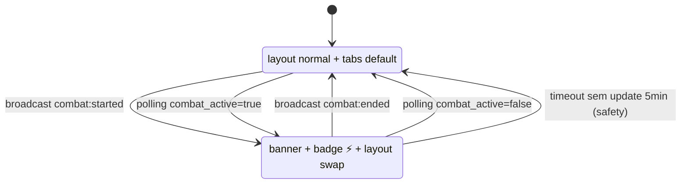

**Eventos:**
- `combat:started` — realtime, latência <2s
- `polling combat_active` — fallback 10s
- `timeout` — safety quando realtime falha por muito tempo

---

## 2. Fluxo — Primeiro acesso ao Player HQ

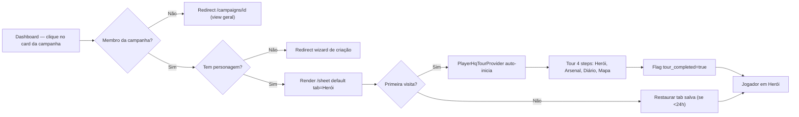

---

## 3. Fluxo — Usar magia em combate (happy path)

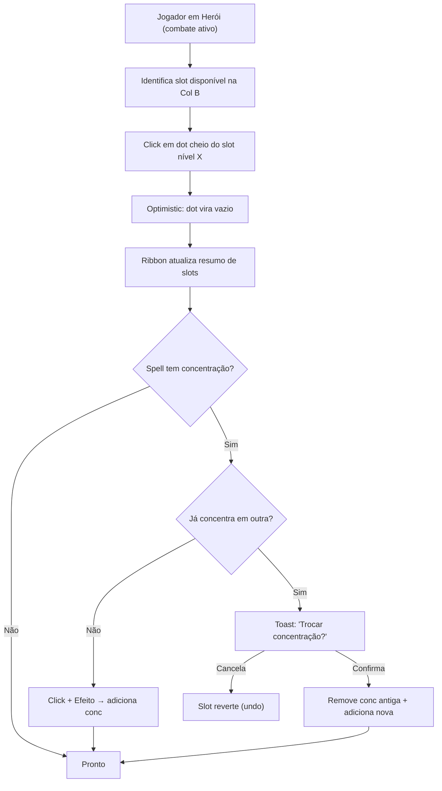

---

## 4. Fluxo cross-mode — Mestre inicia combate + Jogador responde

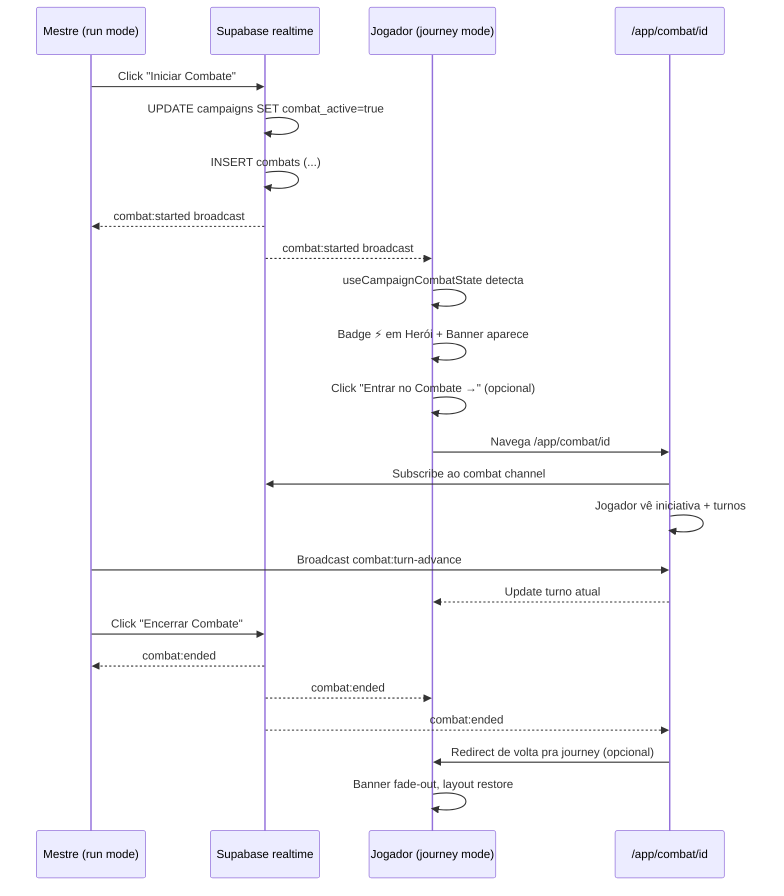

---

## 5. Máquina de estado — Nota rápida em combate

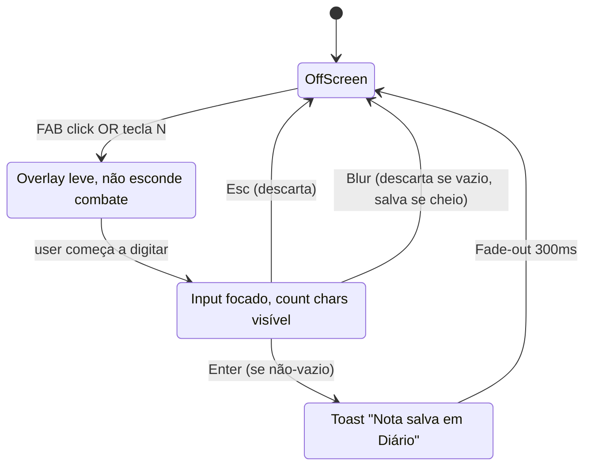

---

## 6. Fluxo — Reconexão zero-drop (regra Resilient Reconnection)

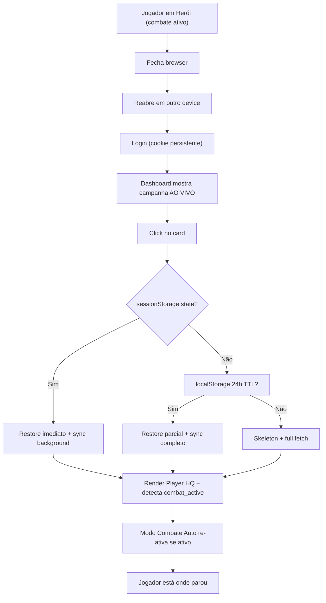

---

## 7. Diagrama — Topologia 7 tabs → 4 tabs (transformação)

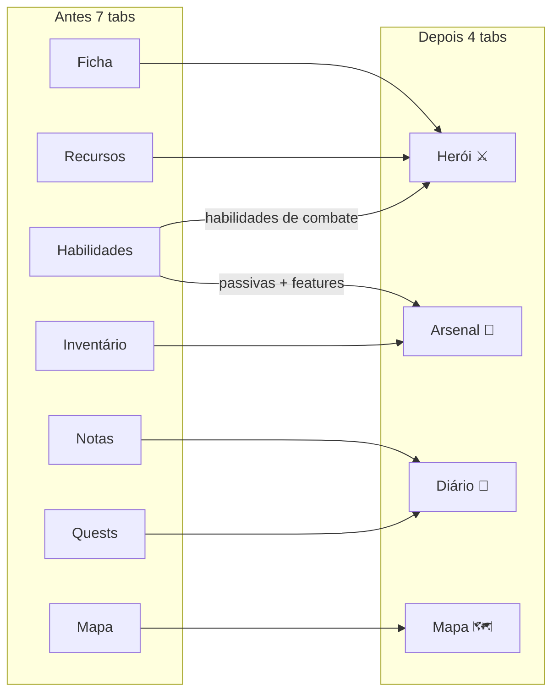

---

## 8. Fluxo — Descanso longo (reset de recursos)

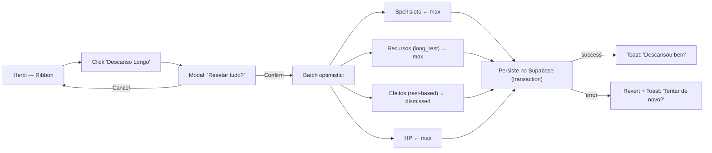

---

## 9. Máquina de estado — Badge na aba

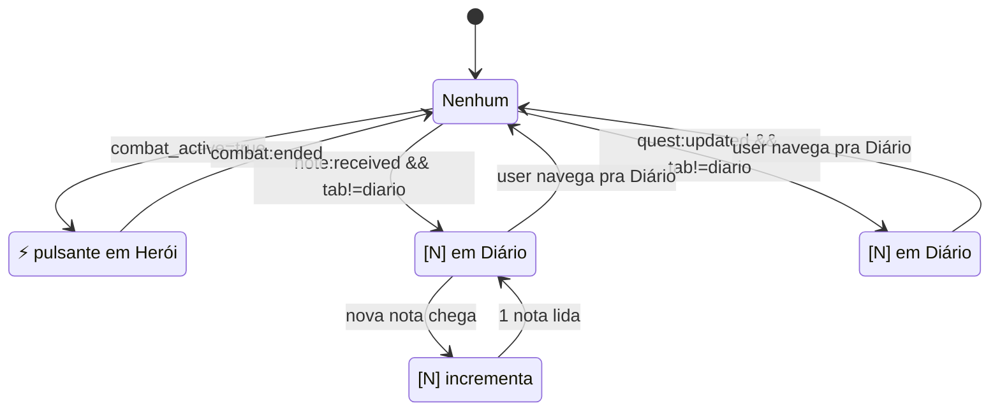

---

## 10. Fluxo — Jogador novo cria primeira nota (onboarding wiki)

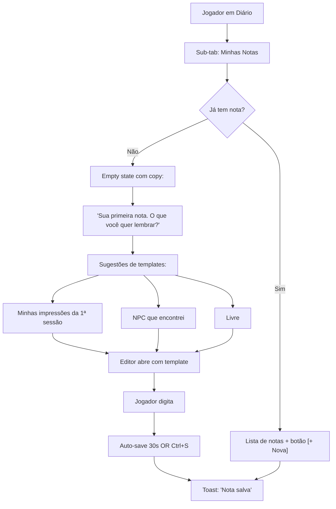

---

## 11. Árvore de decisão — Qual tab o Jogador está buscando?

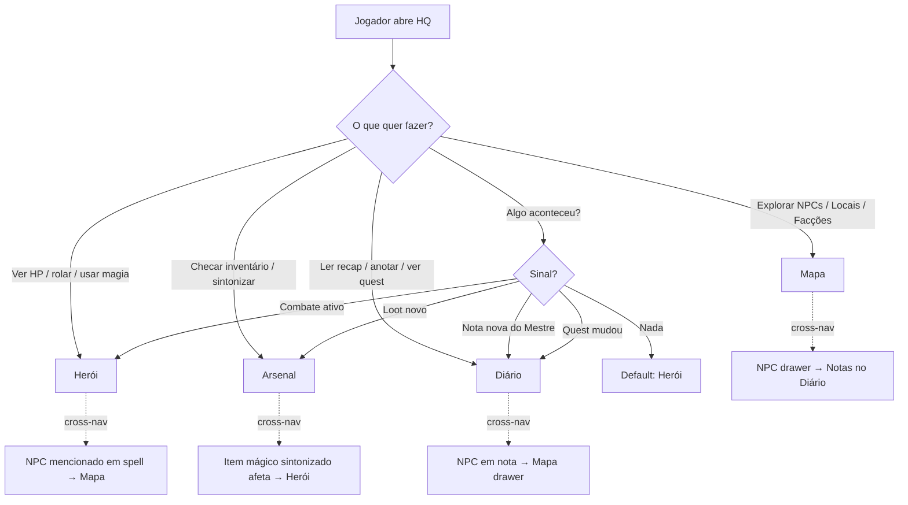

---

## 12. Sequência — Auto-save de nota rápida (overlay)

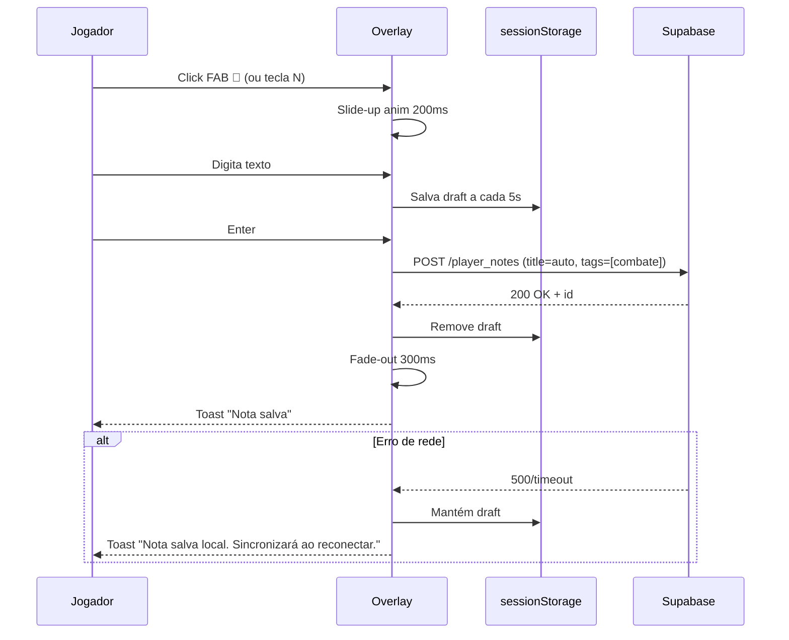

---

## 13. Notas de uso

### Como transcrever no FigJam

Quando Figma plugin destravar:
1. Invocar `mcp__plugin_figma_figma__generate_diagram` com cada snippet Mermaid
2. Passar `mermaidSyntax` e `name` descritivo
3. Tool retorna URL do FigJam criado
4. Mostrar URL ao Dani

### Como renderizar inline

GitHub e a maioria dos IDEs modernos renderizam Mermaid em markdown. Este arquivo é visível ao abrir no editor compatível.

### Convenções

- **stateDiagram-v2** para máquinas de estado
- **flowchart LR** para fluxos direcionais (left-to-right)
- **sequenceDiagram** para interações temporais entre atores

---

## 14. Referências cruzadas

Cada diagrama mapeia pra fluxo do §5 do PRD:

| Mermaid # | Fluxo do PRD | Doc detalhado |
|---|---|---|
| 1 | §6.4 Modo Combate Auto | [02-topologia §6.4](./02-topologia-navegacao.md) |
| 2 | Fluxo 1 (primeiro acesso) | [01-player-journey §1](./01-player-journey.md) |
| 3 | Fluxo 4 (usar magia) | [01-player-journey §4](./01-player-journey.md) |
| 4 | Fluxo 2 (Mestre inicia combate) + cross-mode | [01-player-journey §2](./01-player-journey.md) |
| 5 | Fluxo 8 (nota rápida) | [01-player-journey §8](./01-player-journey.md) |
| 6 | Fluxo 12 (reconexão) | [01-player-journey §12](./01-player-journey.md) |
| 7 | Topologia 7→4 | [02-topologia §6.1](./02-topologia-navegacao.md) |
| 8 | Fluxo 6 (descanso longo) | [01-player-journey §6](./01-player-journey.md) |
| 9 | Badges | [02-topologia §6.3](./02-topologia-navegacao.md) |
| 10 | Minhas Notas onboarding | [05-wireframe-diario](./05-wireframe-diario.md) |
| 11 | Decision tree de tabs | [PRD §6](./PRD-EPICO-CONSOLIDADO.md) |
| 12 | Auto-save overlay | [01-player-journey §8](./01-player-journey.md) |
