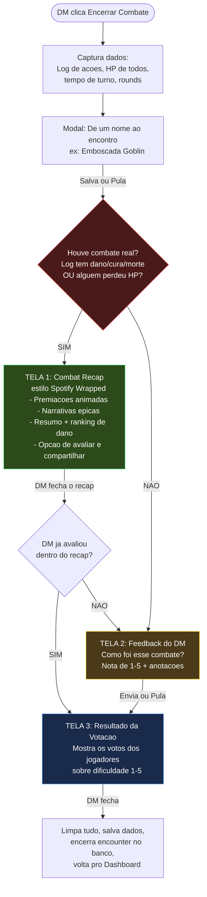
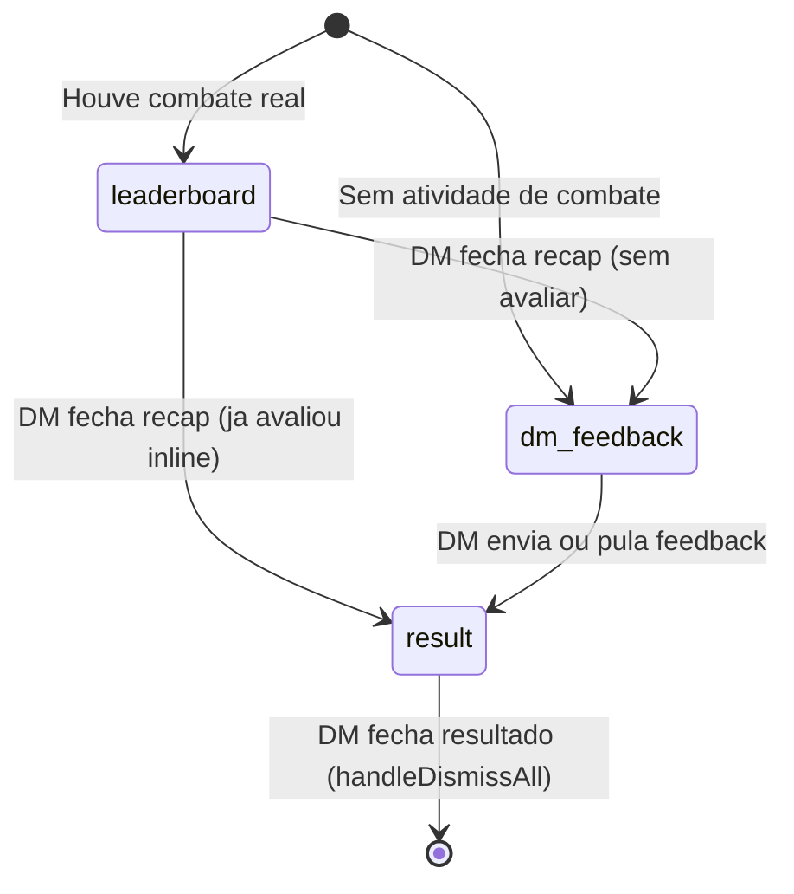
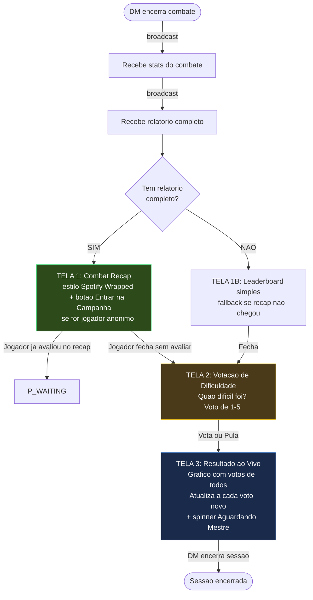
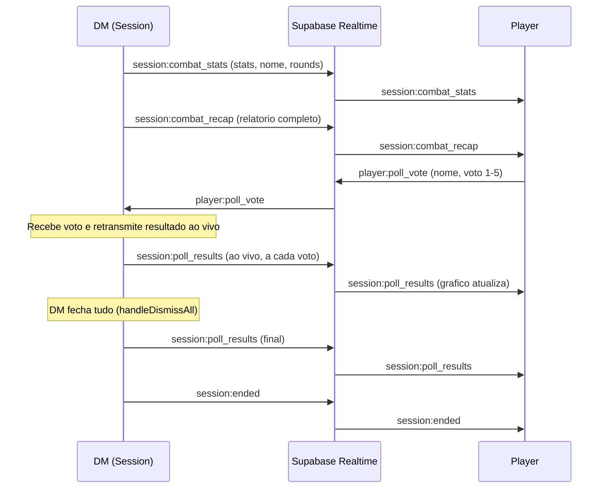
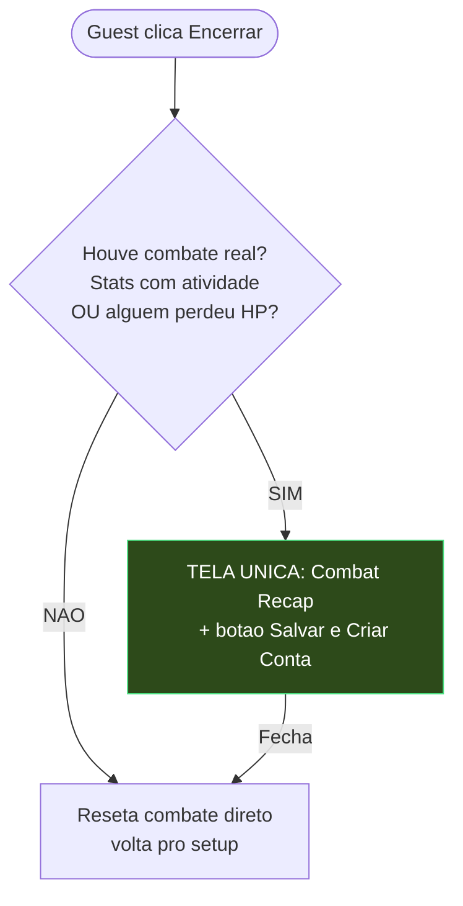

# Fluxo Pos-Combate — Mapa Completo

> Ultima atualizacao: 2026-04-05
> Referencia tecnica do fluxo pos-combate nos 3 modos (DM, Player, Guest).

---

## 1. Fluxo do DM (Sessao Real)



### Passo a passo

| Passo | O que acontece | Arquivo | Linha |
|-------|---------------|---------|-------|
| 1 | DM clica "Encerrar Combate" | `CombatSessionClient.tsx` | 1237 |
| 2 | Sistema fotografa tudo: log, snapshot dos combatentes, tempos | `CombatSessionClient.tsx` | 307-341 |
| 3 | Modal pede nome do encontro | `CombatSessionClient.tsx` | 1440-1464 |
| 4 | DM salva ou pula o nome | `CombatSessionClient.tsx` | 343-352 |
| 5 | Checa: "Houve combate de verdade?" (log + HP) | `CombatSessionClient.tsx` | 204-207 |
| 6 | Se SIM: monta relatorio, broadcast pros jogadores, mostra Recap | `CombatSessionClient.tsx` | 207-297 |
| 7 | Se NAO: pula direto pro feedback do DM | `CombatSessionClient.tsx` | 298-302 |
| 8 | DM fecha Recap -> Feedback (ou pula se ja avaliou no recap) | `CombatSessionClient.tsx` | 1470-1472 |
| 9 | DM da nota + anotacoes -> Resultado da Votacao | `CombatSessionClient.tsx` | 1489-1501 |
| 10 | DM fecha resultado -> salva tudo e vai pro dashboard | `CombatSessionClient.tsx` | 365-406 |

### Maquina de estados do DM



---

## 2. Fluxo do Player (Sessao Real)



### Passo a passo

| Passo | O que acontece | Arquivo | Linha |
|-------|---------------|---------|-------|
| 1 | DM manda broadcast de stats -> Player recebe | `PlayerJoinClient.tsx` | 1159-1169 |
| 2 | DM manda broadcast de recap -> Player recebe | `PlayerJoinClient.tsx` | 1171-1176 |
| 3 | Se recap chegou -> mostra Combat Recap completo | `PlayerJoinClient.tsx` | 1807-1846 |
| 4 | Se nao chegou -> mostra Leaderboard simples (fallback) | `PlayerJoinClient.tsx` | 1848-1856 |
| 5 | Jogador fecha recap -> aparece votacao | `PlayerJoinClient.tsx` | 1860-1890 |
| 6 | Jogador vota ou pula -> ve grafico de votos ao vivo (atualiza a cada voto novo) | `PlayerJoinClient.tsx` | 1893+ |
| 7 | DM fecha tudo -> broadcast session:ended | via broadcast |

### Broadcasts envolvidos



---

## 3. Fluxo do Guest (Combate Rapido)



### Passo a passo

| Passo | O que acontece | Arquivo | Linha |
|-------|---------------|---------|-------|
| 1 | Guest clica "Encerrar" | `GuestCombatClient.tsx` | 1400 |
| 2 | Checa se houve combate real (log + HP) | `GuestCombatClient.tsx` | 1430-1432 |
| 3 | Se SIM: mostra recap + botao "Criar Conta" | `GuestCombatClient.tsx` | 1830-1836 |
| 4 | Se NAO: reseta direto pro setup | `GuestCombatClient.tsx` | 1451-1454 |
| 5 | Sem feedback, votacao ou persistencia | (simplificado de proposito) |

---

## 4. Comparacao entre os 3 Modos

| Recurso | DM (Sessao) | Player (Sessao) | Guest |
|---------|:-----------:|:---------------:|:-----:|
| Combat Recap (Spotify Wrapped) | Sim | Sim (via broadcast) | Sim |
| Nomear o encontro | Sim | -- | -- |
| Feedback do DM (nota + notas) | Sim | -- | -- |
| Votacao de dificuldade | Ve os resultados | Vota (1-5) | -- |
| Salvar relatorio no banco | Sim (automatico) | -- | -- |
| Botao "Criar Conta" | -- | -- | Sim |
| Botao "Entrar na Campanha" | -- | Sim (se anonimo) | -- |

---

## 5. Condicao para mostrar o Recap

A condicao e a mesma nos 3 modos (parity rule):

```
MOSTRAR RECAP se:
  - Log tem atividade (dano causado OU recebido OU cura OU mortes)
  - OU algum combatente perdeu HP (current_hp < max_hp) ou foi derrotado

PULAR RECAP se:
  - Nenhuma das condicoes acima (combate foi iniciado mas nada aconteceu)
```

Isso garante que o recap aparece mesmo se o navegador recarregar no meio do combate (o log some mas o HP dos combatentes sobrevive no banco).
